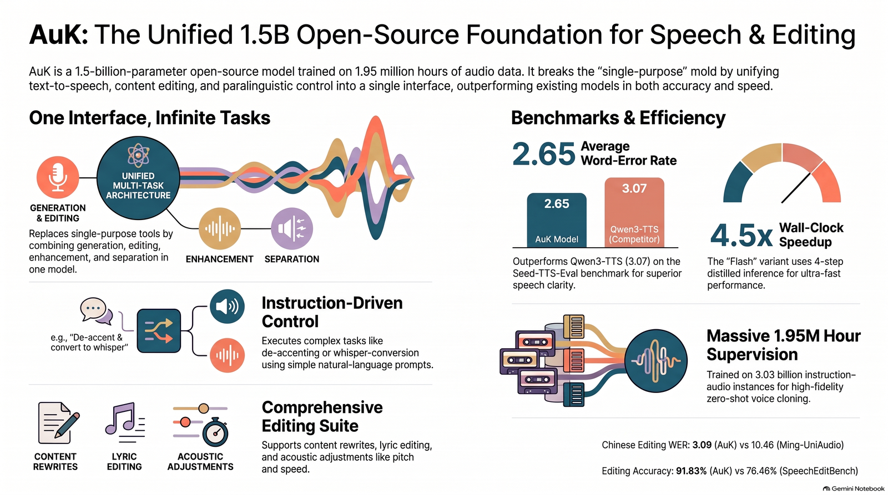

# VocalForge



VocalForge adapts Tencent AuK, a 1.5B-parameter unified speech generation and editing foundation model, for reproducible inference on Kaggle's free 2×Tesla T4 environment — with all model weights served from public Kaggle datasets (no Hugging Face download at runtime).

The notebook demonstrates **24 tasks** across every AuK capability family — TTS, content / acoustic / paralinguistic editing, enhancement, and separation — and renders an **original vs. edited** audio player pair for each one, so you can A/B the result in the browser.

## Why this project matters

**Engineering challenge:** AuK's default configuration exceeds the memory available on a single Kaggle T4. VocalForge makes the model reproducibly executable on Kaggle's free 2×T4 environment by partitioning the model across GPUs, controlling precision, patching upstream compatibility issues, and serving model weights through Kaggle datasets.

Specifically, getting AuK to run — let alone fit — on Kaggle's free tier required solving each of these:

- **Memory partitioning** — the 3B Qwen encoder is pinned to `cuda:1` (~9.3 GiB) while the DiT + VAE stay on `cuda:0`; single-GPU inference OOMs at even ~10 s of audio, dual-GPU handles 28 s clips.
- **Precision control** — the DiT is loaded in FP16 (the default FP32 build OOMs a 15 GiB T4) while sampling runs under bf16 autocast (FP16 autocast produces NaN latents).
- **Upstream compatibility** — AuK's dependency pins pull non-CUDA torch/torchaudio/torchvision, Pillow, numpy, and scipy builds that break the Kaggle image; the image's CUDA stack is snapshotted and restored after install.
- **Bug patching** — the pinned AuK revision has a long-audio attention-mask/sequence-length mismatch and a cross-task text-cache bug that both crash inference; both are patched at load time.
- **Weight delivery** — ~18 GB of model weights ship as three public Kaggle datasets, so a run needs zero Hugging Face downloads (and Kaggle's ~9 GB dataset-upload cap is why the Qwen encoder is split across two of them).

The result: one click — Run All — on a free Kaggle account produces 24 verified, playable speech examples on the same 2×T4 configuration used throughout this project.

## Engineering Contribution

VocalForge focuses on the engineering required to make a large speech foundation model reproducibly executable in a constrained GPU environment.

The original AuK configuration does not fit comfortably on a single 15 GB Tesla T4. The inference pipeline was adapted for Kaggle's free 2×T4 environment by:

- **Partitioning the model across two GPUs** — the Qwen2.5-Omni encoder lives on `cuda:1` (~9.3 GiB); the DiT + VAE + activations stay on `cuda:0`.
- **Using FP16 weights** to reduce memory pressure (the FP32 DiT build OOMs a single T4).
- **Using BF16 autocasting during sampling** to avoid FP16 numerical instability (FP16 autocast produces NaN latents).
- **Staging model weights through Kaggle datasets** instead of downloading from Hugging Face at runtime.
- **Pinning the upstream AuK revision** for reproducibility (upstream `main` moves fast and changes the exact lines the pipeline patches).
- **Applying runtime compatibility patches** for upstream issues (long-audio attention-mask/sequence-length mismatch, cross-task text-cache poisoning, non-CUDA dependency builds).
- **Measuring GPU memory usage and validating full-length inference** — GPU 0 peak 11.6 GiB / GPU 1 peak 9.3 GiB, with the full 19.2 s and 28 s two-speaker clips running uncropped.

The result is a reproducible 24-task speech generation and editing demonstration running on two free-tier T4 GPUs.

## Results

| Metric | Result |
|---|---|
| Foundation model | Tencent AuK 1.5B |
| GPU environment | 2× NVIDIA Tesla T4 |
| GPU memory | 15 GB each |
| GPU 0 peak | 11.6 GiB |
| GPU 1 peak | 9.3 GiB |
| Audio format | 24 kHz mono WAV |
| Demonstrated tasks | 24 |
| Full notebook runtime | ~42 min |
| GPU time | ~40 min |
| Longest demonstrated clip | 28 s |

The final two separation tasks run **uncropped** audio across both GPUs, demonstrating that the multi-GPU configuration is required for longer inference workloads.

## Technology

- Python
- PyTorch
- CUDA
- NVIDIA Tesla T4
- Multi-GPU inference
- Tencent AuK
- Qwen2.5-Omni-3B
- Kaggle
- Jupyter
- Safetensors

## Run it yourself on Kaggle

Open the notebook and hit **Run All** (GPU accelerator, 2× T4 — the kernel metadata already sets this):

**[▶ Kaggle notebook: AuK speech on T4 x2 (Kaggle weights)](https://www.kaggle.com/code/dsptlp/auk-speech-on-t4-x2-kaggle-weights)**

The notebook needs the three public datasets (attached automatically):

| Dataset | Contents | Size |
|---|---|---|
| [`dsptlp/auk-base`](https://www.kaggle.com/datasets/dsptlp/auk-base) | AuK-Base checkpoint: `config.yaml`, `auk_base.safetensors`, `vae.safetensors` | 6.2 GB |
| [`dsptlp/qwen25-omni-shard13`](https://www.kaggle.com/datasets/dsptlp/qwen25-omni-shard13) | Qwen2.5-Omni-3B encoder, shards 1+3 + tokenizer/configs | ~7 GB |
| [`dsptlp/qwen25-omni-shard2`](https://www.kaggle.com/datasets/dsptlp/qwen25-omni-shard2) | Qwen2.5-Omni-3B encoder, shard 2 | 4.7 GB |

> The Qwen encoder is split into two datasets because Kaggle silently drops dataset uploads larger than ~9 GB.
> `AuK/` and `Qwen2.5-Omni-3B/` are local staging directories used to build the Kaggle datasets and are intentionally excluded from Git because of their size.

## What AuK can do

AuK unifies speech generation and speech editing behind a single natural-language instruction interface:

1. **Speech Generation** — zero-shot TTS (clone any voice from a reference clip), instruct TTS (from a voice description alone).
2. **Content Editing** — replace / insert / remove words in a recording; lyric editing that preserves the melody.
3. **Acoustic Editing** — pitch (semitones), speed (×rate), volume (dB) via text instructions.
4. **Paralinguistic Editing** — emotion & timbre control, de-accenting, nonverbal-sound add/remove (breaths, laughs, coughs), whisper conversion.
5. **Enhancement & Separation** — denoising, dereverberation, speaker separation by speaking order or content, vocal/music separation.

## How the notebook works

1. **Install** — pulls the pinned AuK revision (`e1c935e`) as a tarball, `pip install -e .`, then **restores the Kaggle image's CUDA torch stack** (AuK's pins pull non-CUDA torch/torchaudio/torchvision, Pillow, numpy/scipy builds that break CUDA loading).
2. **Load weights from Kaggle** — copies `dsptlp/auk-base` → `ckpts/AuK` and both Qwen shard datasets → `ckpts/Qwen2.5-Omni-3B` (mount-path-proof globbing). Nothing is fetched from Hugging Face.
3. **Single-T4 fit** — the DiT backbone is loaded in FP16 (FP32 OOMs a 15 GB T4) while sampling runs under bf16 autocast (fp16 autocast produces NaN latents).
4. **Dual-GPU split** — the Qwen text encoder lives on `cuda:1` (~9.3 GiB); the DiT + VAE + activations stay on `cuda:0`. This is what makes the full-length 19–28 s clips possible (GPU 0 peak 11.6 GiB / GPU 1 peak 9.3 GiB).
5. **Upstream-bug workarounds** (patched at load time, pinned revision): long-audio attention-mask/sequence-length mismatch, a `text_cond` cache that poisons the next task's lengths, and a relative `ckpts/` path in `config.yaml` (`qwen_path=` override).
6. **24 tasks** — each wrapped so one failure doesn't stop the rest; every task plays the **Original + Edited** clip side by side.
7. **Length cap** — demo clips longer than ~10 s OOM a single T4 in this config, so long sources are cropped to 6 s; the last two examples run the **uncropped** clips on both GPUs.

## Examples (before → after)

All pairs are 24 kHz mono WAVs, generated by the notebook on Kaggle (see `generated_audio/` for the flat set of outputs). Press play on each to compare — **before** is the input as fed to the model, **after** is what AuK generated.

| Task | What it does | Original | Edited |
|---|---|---|---|
| `zero_shot_tts` | Speak text in the voice of the reference clip | [▶](examples/zero_shot_tts/before.wav) | [▶](examples/zero_shot_tts/after.wav) |
| `instruct_tts` | Generate speech from a voice description, no reference | — | [▶](examples/instruct_tts/after.wav) |
| `content_edit` | Replace a phrase in a recording | [▶](examples/content_edit/before.wav) | [▶](examples/content_edit/after.wav) |
| `content_insert` | Insert a phrase after an anchor | [▶](examples/content_insert/before.wav) | [▶](examples/content_insert/after.wav) |
| `content_remove` | Remove a phrase | [▶](examples/content_remove/before.wav) | [▶](examples/content_remove/after.wav) |
| `lyric_edit` | Rewrite a lyric line, keep the melody | [▶](examples/lyric_edit/before.wav) | [▶](examples/lyric_edit/after.wav) |
| `pitch_edit` | Raise pitch by 2 semitones | [▶](examples/pitch_edit/before.wav) | [▶](examples/pitch_edit/after.wav) |
| `speed_edit` | Speed up speech 1.5× | [▶](examples/speed_edit/before.wav) | [▶](examples/speed_edit/after.wav) |
| `volume_edit` | Increase volume by 10 dB | [▶](examples/volume_edit/before.wav) | [▶](examples/volume_edit/after.wav) |
| `emotion_edit` | Change emotion to happy | [▶](examples/emotion_edit/before.wav) | [▶](examples/emotion_edit/after.wav) |
| `emotion_sad` | Change emotion to sad | [▶](examples/emotion_sad/before.wav) | [▶](examples/emotion_sad/after.wav) |
| `timbre_vc` | Convert timbre to "a deep, calm male voice" | [▶](examples/timbre_vc/before.wav) | [▶](examples/timbre_vc/after.wav) |
| `de_accent` | Remove the Sichuan accent (→ standard Mandarin) | [▶](examples/de_accent/before.wav) | [▶](examples/de_accent/after.wav) |
| `nonverbal_add` | Add a cough before "We tested" | [▶](examples/nonverbal_add/before.wav) | [▶](examples/nonverbal_add/after.wav) |
| `nonverbal_remove` | Remove humming from the audio | [▶](examples/nonverbal_remove/before.wav) | [▶](examples/nonverbal_remove/after.wav) |
| `speech_enhance` | Full enhancement (noise + reverb removal) | [▶](examples/speech_enhance/before.wav) | [▶](examples/speech_enhance/after.wav) |
| `enhance_denoise` | Denoise only | [▶](examples/enhance_denoise/before.wav) | [▶](examples/enhance_denoise/after.wav) |
| `enhance_dereverb` | Dereverberate only | [▶](examples/enhance_dereverb/before.wav) | [▶](examples/enhance_dereverb/after.wav) |
| `speech_separation` | Keep the second speaker (6 s crop) | [▶](examples/speech_separation/before.wav) | [▶](examples/speech_separation/after.wav) |
| `target_speaker_extraction` | Keep only the speaker who says "get what" (6 s crop) | [▶](examples/target_speaker_extraction/before.wav) | [▶](examples/target_speaker_extraction/after.wav) |
| `vocal_extraction` | Keep the clean singing voice (6 s crop) | [▶](examples/vocal_extraction/before.wav) | [▶](examples/vocal_extraction/after.wav) |
| `vocal_all_human` | Keep all human voices, drop the rest (6 s crop) | [▶](examples/vocal_all_human/before.wav) | [▶](examples/vocal_all_human/after.wav) |
| `separation_full` | **Dual-GPU:** full 19.2 s separation, uncropped | [▶](examples/separation_full/before.wav) | [▶](examples/separation_full/after.wav) |
| `target_speaker_full` | **Dual-GPU:** full 28 s extraction, uncropped | [▶](examples/target_speaker_full/before.wav) | [▶](examples/target_speaker_full/after.wav) |

## Notes & caveats

- **GPU quota** — a full run takes ~40 minutes of GPU time on the free tier (6 h/week; runs still work above quota but may slow).
- **Runtime** — the whole notebook (24 tasks) completes in ~42 minutes of wall time on 2× T4.
- **Reproducibility** — the AuK source is pinned to commit `e1c935e`; upstream `main` has since changed the exact lines the notebook patches, so don't bump the revision without re-verifying.

## Licensing

This repository combines our own project code with upstream model weights, and each layer is licensed separately — please respect all of them:

| Component | License |
|---|---|
| **VocalForge code** — this repo's notebook, scripts, CI, docs, examples | **MIT** (see [`LICENSE`](LICENSE)) |
| **Tencent AuK** — upstream code *and* model weights (`tencent/AuK`, mirrored in `dsptlp/auk-base`) | **MIT** — AuK's LICENSE covers "training code, inference code, parameters, and weights" |
| **Qwen2.5-Omni-3B** — upstream encoder weights (`Qwen/Qwen2.5-Omni-3B`, mirrored in `dsptlp/qwen25-omni-shard13` + `dsptlp/qwen25-omni-shard2`) | **Qwen RESEARCH LICENSE AGREEMENT** — research / non-commercial use only; redistribution must pass the agreement and notices along |
| **Model weights in the Kaggle datasets** | governed by the upstream licenses above — the datasets only serve them for Kaggle inference, they are not re-licensed here |

Notes:
- The Qwen RESEARCH LICENSE restricts **commercial** use — check it (and Tencent's terms) before any product use.
- The Kaggle dataset license tags are best-effort (`MIT` / `other`); the authoritative terms are the upstream LICENSE files referenced above.

## Layout

```
ai-local.ipynb            the Kaggle notebook (pushed as-is)
kernel-metadata.json      GPU x2 + dataset sources for the Kaggle push
AuK/  Qwen2.5-Omni-3B/    local weight mirrors used to build the Kaggle datasets; intentionally excluded from Git
generated_audio/          all 24 generated outputs (flat)
examples/                 before/after pairs per task
```